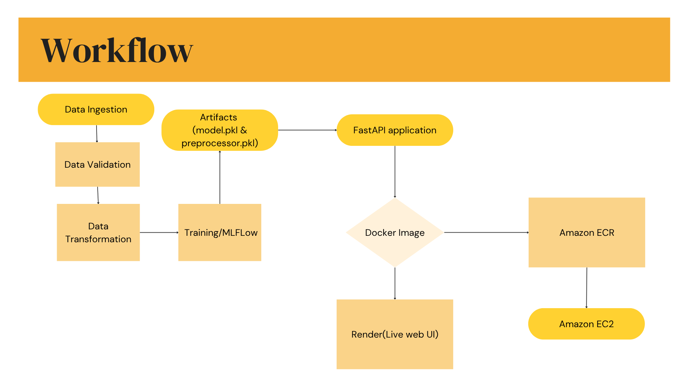

#  AI Job Impact Predictor | End-to-End MLOps Pipeline

## 📌 Project Overview
This project is an end-to-end Machine Learning Operations (MLOps) pipeline designed to predict the survival probability and impact of AI on various job sectors. Using a dataset from Kaggle, this project demonstrates a fully automated, production-ready system—from data ingestion and feature engineering to CI/CD deployment and a live web interface.

Instead of just building a model in a Jupyter Notebook, the goal of this project was to focus heavily on **Software Engineering and CI/CD best practices**, ensuring the model is scalable, trackable, and accessible.

### 🔗 Quick Links
* **Live Web Application:** [[Link](https://ai-job-impact.onrender.com/)]
* **Video Walkthrough:** [[Link](https://www.youtube.com/watch?v=7jV7S5xCIXo)]

---

## 🏗️ System Architecture & Workflow

The system follows a strict modular architecture, broken down into a training pipeline and a deployment pipeline. 

 

1. **Data Ingestion & Validation:** Reads raw data and strictly validates schemas to prevent pipeline breakage.
2. **Data Transformation:** Handles complex feature engineering, including `scaling` for numerical data and `OneHotEncoder` for categorical data to avoid the curse of dimensionality. Outputted as a `preprocessor.pkl`.
3. **Model Training & Tracking:** Evaluates multiple ensemble models (Random Forest, Gradient Boosting, etc.). All parameters, metrics (F1, Precision, Recall), and artifacts are strictly tracked using **MLflow** and **DagsHub**.
4. **FastAPI & Docker:** The best performing model is wrapped in a FastAPI backend and containerized using Docker.
5. **CI/CD Deployment:** **GitHub Actions** automatically triggers on `push`. It builds the Docker image and deploys it simultaneously to **Amazon ECR/EC2** and **Render** for highly available web access.

---

## 🛠️ Tech Stack
* **Machine Learning:** Scikit-Learn, Pandas, NumPy
* **Experiment Tracking:** MLflow, DagsHub
* **Backend & API:** FastAPI, Python 3.10
* **Containerization:** Docker
* **CI/CD Automation:** GitHub Actions
* **Cloud & Deployment:** AWS (ECR, EC2), Render, MongoDB Atlas

---

## ⚙️ Environment Variables & Secrets

To run this pipeline or deploy it via GitHub Actions, you must configure the following repository secrets:

### AWS Deployment Secrets
* `AWS_ACCESS_KEY_ID`: Your AWS IAM Access Key.
* `AWS_SECRET_ACCESS_KEY`: Your AWS IAM Secret Key.
* `AWS_REGION`: The AWS region for your ECR/EC2 (e.g., `us-east-1`).
* `AWS_ECR_LOGIN_URI`: The URI for your Amazon Elastic Container Registry.
* `ECR_REPOSITORY_NAME`: The specific name of your ECR repository.

### Application & Database Secrets
* `MONGO_DB_URL`: The connection string to your MongoDB Atlas cluster.
* `MLFLOW_TRACKING_PASSWORD`: Your DagsHub access token for MLflow tracking.

